# Day 5 - Active Directory Users, OUs, and Group Policy

## 🎯 Objective

Create a structured Active Directory environment with users, organizational units, and basic security policies.

---

## 🧠 Lab Design Overview

The main goal of this lab is to set up Organizational Units (OUs) populating them with user accounts and linking a group policy

1) Create Organizational Units (OU): Employees, Information Tech, Servers
2) Populate Employees and Information Tech OUs with necessary user accounts
3) Create and link a Group Policy to enfore password and account login policies
4) Generate logs: Account logins, account lockouts/unlocks, etc.

## ⚙️ AD Set-up Specs

| Accounts          | Username   | OU        |
| ----------------- | ---------- | --------- |
| John Doe          | jdoe       | Employees |
| Jane Smith        | jsmith     | Employees |
| Lisa Shermaine    | lshermaine | Employees |
| Carson James      | cjames     | Employees |
| Samantha Zalisa   | szalisa    | Employees |
| Nathan Cumberland | ncumberlad | Employees |
| IT Admin          | itadmin    | IT        |

## 🌐 Setup Walkthrough

**OU and User Accounts Creation**
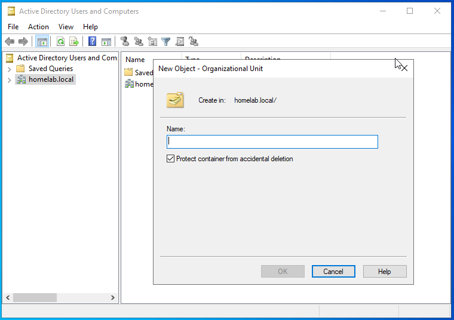
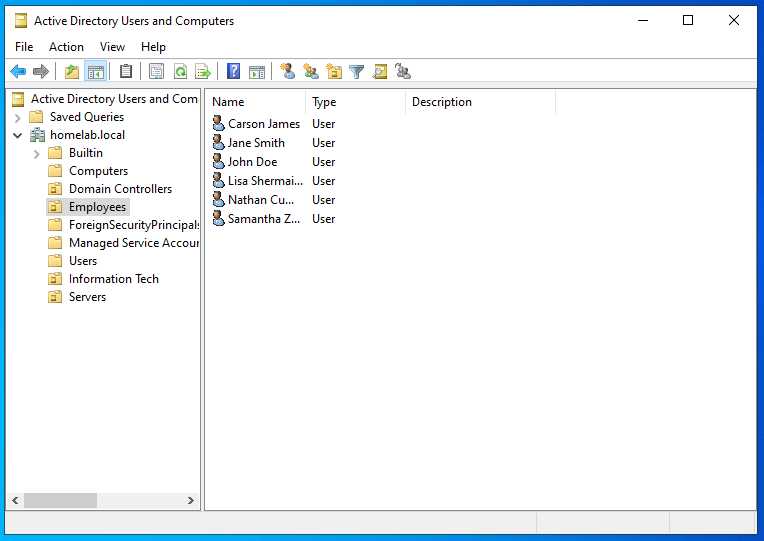
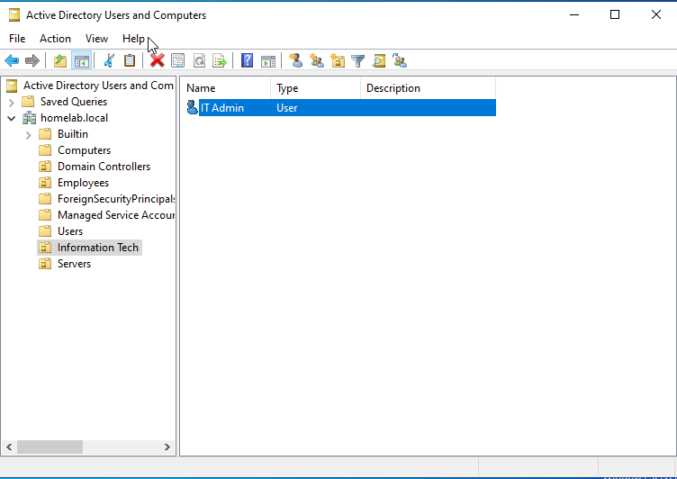
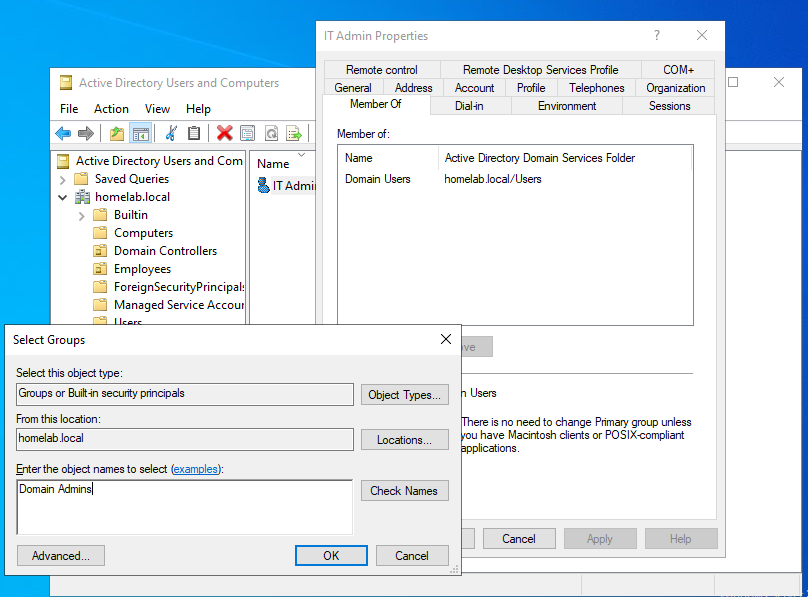
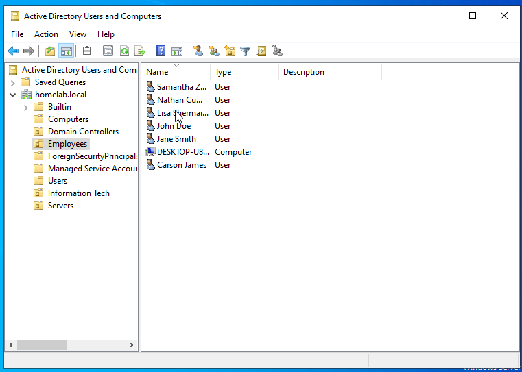

**Group Policy Setup**
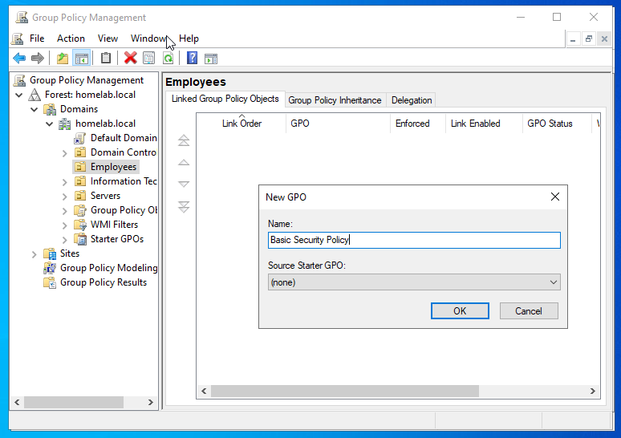
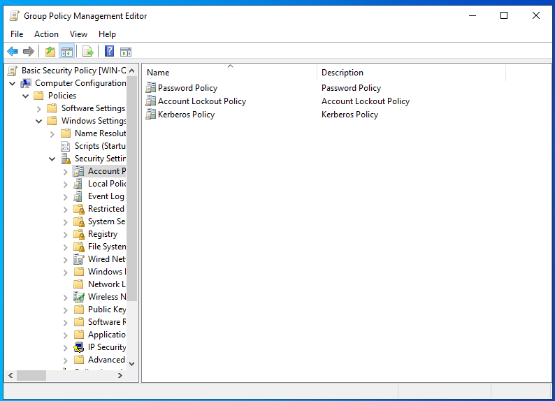
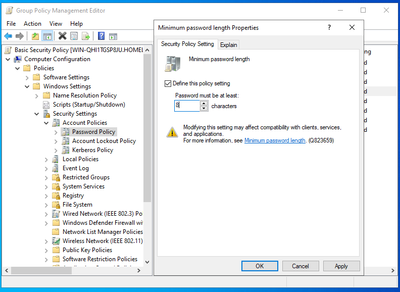
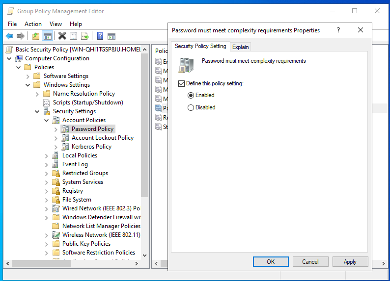
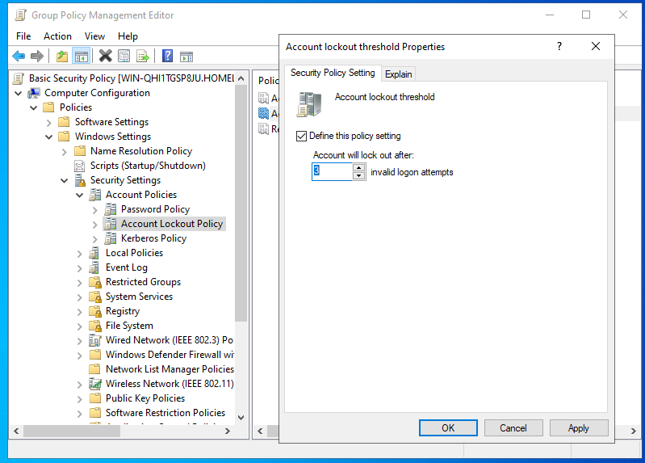
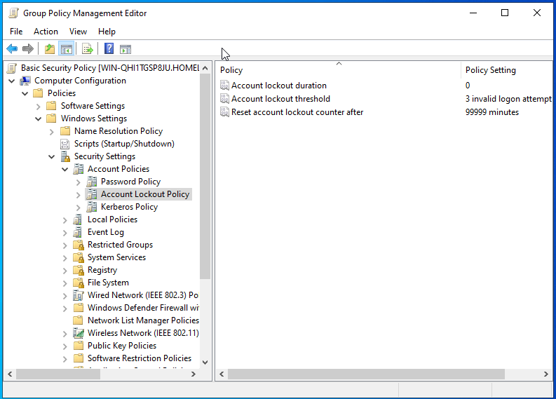

---

## 🧠 Key Concepts Learned

* Organizational Units (OUs)
* Group Policy Objects (GPO)
* Active Directory user management

---

## ⚠️ Issues Encountered

The main issues I encountered was when I was trying to generate logs for a later lab. What I was trying to simulate is a failed login attempts and the account to get lockt out. When I first tried I thought that policy was enabled by default but it turns out I had to set it manually. So I went into the **Group Policy** that I have linked to the **Employees OU** and eddited it. I was able to enable the account lockout policy. I also took the liberty to make it so that, once an account is locked out, the admin would have to unlock their account.

When I tried the second time logging into one of the accounts I created. The account lockout policy did not trigger. Then I remembered I had to update the account's GP memory itself. So I logged into the account and ran **gpupdate /force** in CMD. Then I logged out and tried again, but still it did not work.

I did some research why this is the case and I found out that the account lockout policy has to be enabled and set in the **Default Domain Policy**. Apparantly the account lockout policy is a *domain-wide* policy and due to the AD architacture. For domain-wide policies, it has to be enforced by the Domain Controller, so it had to be set on the **Default Domain Policy**.

So I updated the Default Domain Policy to:

* **Account lockout duration:** 0 (Admin has to manually unlock the account)
* **Account lockout threshold:** 3 invalid logon attempts
* **Reset account lockout counter after:** 30 minutes

When I tried again to see if a User account will lockout, it unfortunately did not. I was stuck at this point and checked why this is the case. I found out that, whenever there is a change to any GP both the windows machines (users) and the Domain Controller have to run **gpupdate /force**. When I ran that on the Domain Controller and ran it again on the User account when logged in normally. I tried again to see if I can lockout the User account and after 3 invalid attempts, the account was locked. Then checked the Domain controller for the User account and it gave the option to unlock it.

---

## 🚀 Next Steps

* Configure SIEM ingestion
* Install monitoring tools on Ubuntu
* Begin detecting authentication events
* Simulate attacks from Kali

---
