# Day 6 — Wazuh SIEM Deployment & Endpoint Integration

## 🎯 Objective

Deploy and configure a Wazuh SIEM server to centralize security monitoring and endpoint telemetry collection within the homelab environment.

---

## 🧱 Lab Environment

| Machine      | Role              | IP Address    |
| ------------ | ----------------- | ------------- |
| DC01         | Domain Controller | 192.168.56.10 |
| WIN10-CLIENT | Windows Endpoint  | 192.168.56.20 |
| SIEM01       | Wazuh SIEM Server | 192.168.56.40 |

---

## 🛠️ Technologies Used

- VirtualBox
- Ubuntu Server 24.04 LTS
- Wazuh v4.14.5
- Windows 10 Pro
- PowerShell

---

## 🧠 Key Concepts Learned

- SIEM deployment and configuration
- Endpoint telemetry collection
- Linux networking and interface configuration
- NAT vs Internal Network segmentation
- Port forwarding in VirtualBox
- Wazuh agent enrollment
- Ubuntu service troubleshooting
- Linux LVM storage expansion

---

## ⚙️ Tasks to Complete

### ✅ Installing Wazuh SIEM

- Installing Wazuh on Ubuntu server
- Will be installing Wazuh using the Wazuh installer assistant
- This will install Wazuh Manager, Wazuh Indexer, and Wazuh Dashboard

#### Steps Followed

- First need to ensure that Ubuntu server is up to date and curl is installed

```bash
sudo apt update && sudo apt upgrade -y
sudo apt install curl -y
```

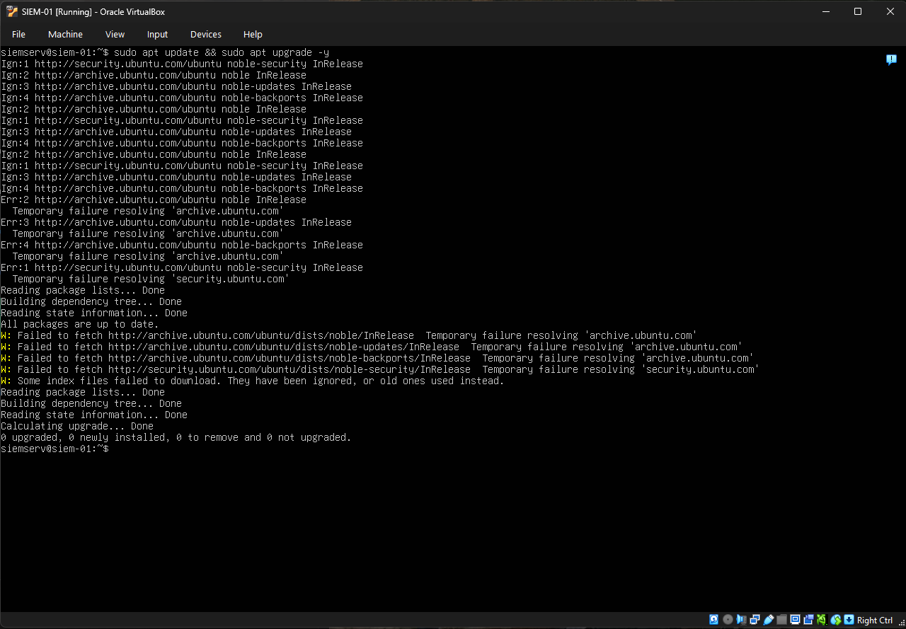
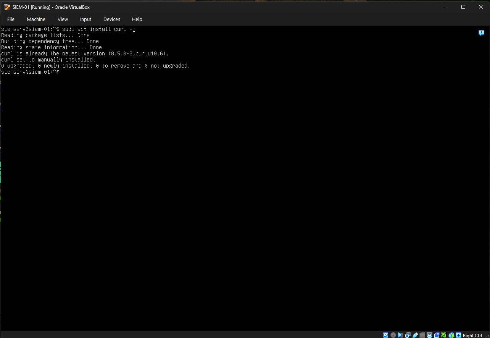

```bash
curl -sO https://packages.wazuh.com/4.14/wazuh-install.sh && sudo bash ./wazuh-install.sh -a
```

- There was an issue that occured when trying to install Wazuh on the Ubuntu server
- The cmd to install Wazuh did nothing and would just enter in a new line

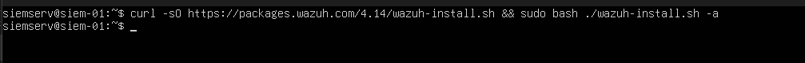

- First I initally thought that the VM needed to be restarted but that resulted in the same issue
- Then after comming to a realization that the cmd installs a package from Wazuh's documentation page, the Ubuntu server needed access to the internet inorder to do so
- At that moment, my Ubuntu server only had an Internal Network adapter and was not connected to the internet
- Looked online and to have the Ubuntu server to connect to the network, it needed a 2nd adapter configured to NAT with DHCP enabled, so that an IP can beassigned to it to access the internet.
- Therefore I added a 2nd network adapter

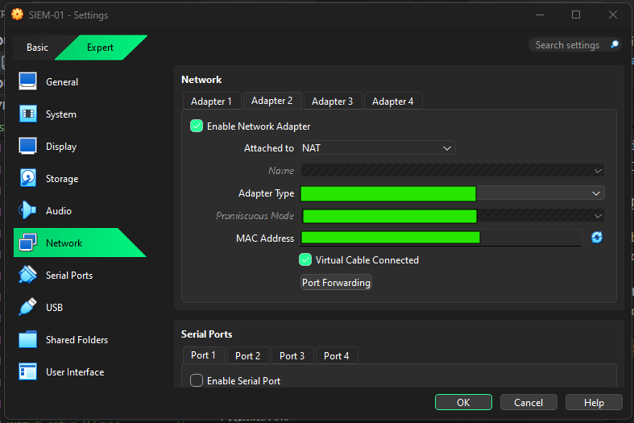

- When I rebooted my Ubuntu server and tried to reach 8.8.8.8
- But that was not successful
- I then checked what the state is for the enp0s8 adapter was and it was "state DOWN"

```bash
ip a
```

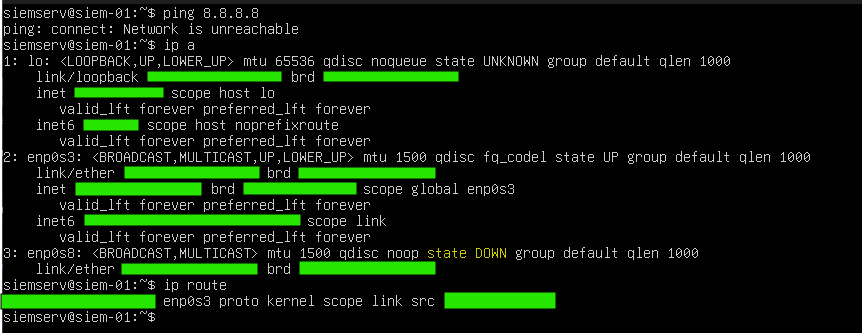

- Turned out, just like how the Internal Netork was first configured when I was setting up the Ubuntu server
- The enp0s8 needed to be configured as well
- For every new adapter added to a VM, the adapter needs to be added to the network config of the VM
- So I went into the 00-installer-config.yml file and added enp0s8 to it, setting dhcp4 to true for automatic IP assignment

```bash
sudo nano /etc/netplan/00-installer-config.yml
```

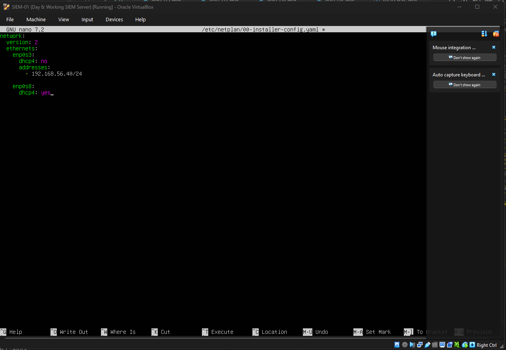

- Ensured that the server recognized the new additions to the network config file

```bash
sudo netplan apply
```

- Then I tried the Wazuh installation cmd again and this time it ran

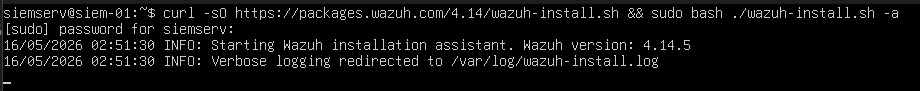

- Then shortly after I ran into another issue that said that the Ubuntu VM did not meet the hardware requirements

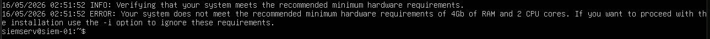

- Where I went into the VM settings of my Ubuntu server an updated the ram from 2GB to 4GB and the cores from 1 to 2

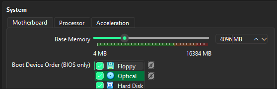


- I tried running the Wazuh installation cmd and ran into another error
- The installation did not complete because there was an error with starting the Wazuh Dashboard

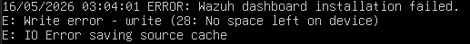

- This is where I got stuck
- I first checked again the system requirements for Wazuh on their documentaion page [Wazuh Documentation](https://documentation.wazuh.com)
- It said that Wazuh needs a minimum of 4GB of ram, 2 Cores but 4 preferred, and 50GB of storage
- From what I found on the internet, it said that this typically hapens because the VM does not have enough storage
- To check if that was the case, I was advised from my research for solutions to the issue to check the filesystem usage and available ram
- As this is the key indicator to know if the VM is running out of disk space

```bash
df -h           # To check the filesystem space and remaining disk size
free -h         # To check the RAM availability
```

- I didn't know much what to look for when typing in these cmds
- But from what I remembered when I first created the Ubuntu VM, I set the storage to 30GB
- So I went into the storage settings in VirtualBox for my Ubuntu machine and changed the storage from 30GB to 50GB

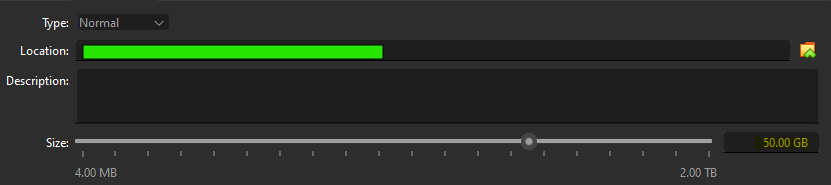

- Restarted the Ubuntu SIEM VM and verified that the VirtualBox disk expansion was recognized by the operating system
- That is where I found out that the newly added 20GB of storage did not automatically expand the logical volume and filesystem
- I checked out why that is and found out that it is because VMs are implemented on a stacked layered storage architecture, and if storage was expanded, extra steps were needed to merge that extra space inside the VM
- So I did just that, and found these cmds to expand the logical volume and to resize the filesystem of my Ubuntu NM

```bash
sudo lvextend -l +100%FREE /dev/mapper/ubuntu--vg-ubuntu-lv     # Expands the logical volume to utilized newly added 20GB of storage 

sudo resize2fs /dev/mapper/ubuntu--vg-ubuntu--lv                 # Resizes the filesystem to ensure the new storage is actually usable
```

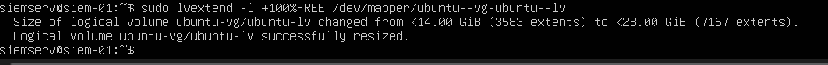
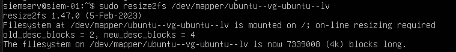

- After the ordeal of ensuring the VM has the requirements for installing Wazuh
- Tried to run the Wazuh installation cmd again and this time it was able to complete its installation with no issues

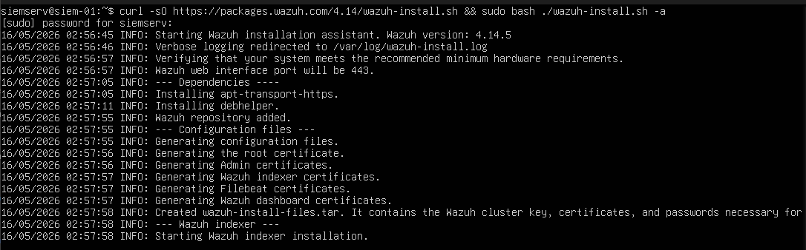
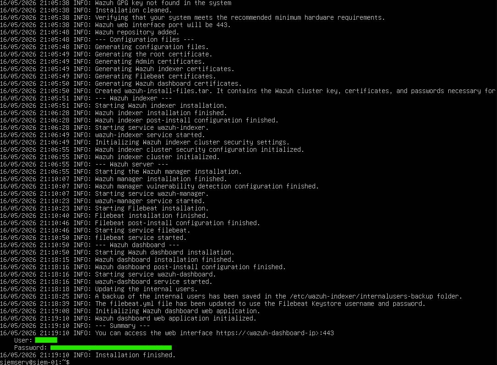

---

### ✅ Acces Wazuh Dashboard

- After installing Wazuh, I checked if I as able to access it

#### Steps Followed

- I launched my Windows Client VM and opened Microsoft Edge to access the Wazuh Dashboard through *https://192.168.56.40*
- Which was sucessfull and I was able to input the login creds that Wazuh provided to access the dasboard

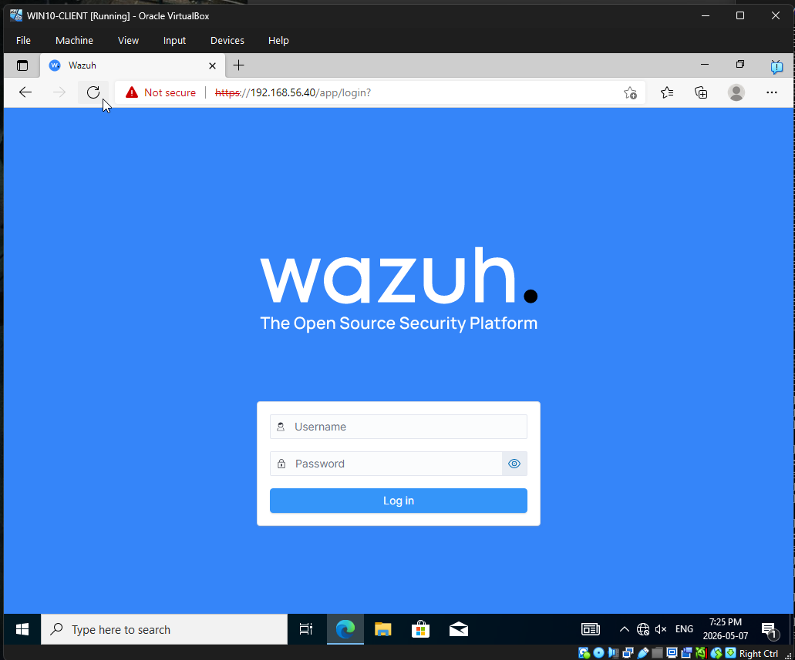

- But I figured that launching Wazuh using my Windows client would be too resources heavy
- I wanted to see if I was able to run Wazuh on my local host machine to simply operations and to use less resources
- I found out that it was possble and that I need to enable *Host-Only Adapter* on my Ubuntu server to access it [Connecting WIndos Endpoint to Wazuh](https://infosecwriteups.com/connecting-a-windows-endpoint-to-wazuh-e4b21e941f3e)
- I also ensured that the the enp0s9 ethernet on the Ubuntu server is configured
- I set the dhcp4 to yes just like for enp0s8 ethernet

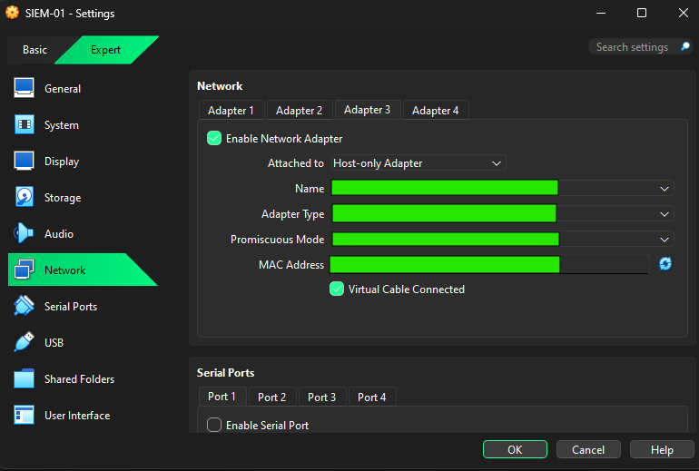
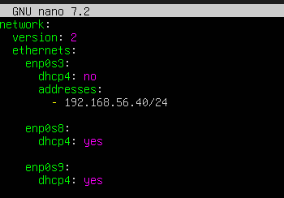

- I restarted the Wazuh Dashboard and after checking the enp0s9 IP, tried to access the Wazuh Dashboard on my local host machine
- But when I did, I was constantly getting a *ERR_CONNECTION_TIMED_OUT*
- I went back to the blog and it said that if there was issues trying to access the dashboard, I needed to enable the Uncomplicated Firewall and set a rule to allow 443/TCP traffic to access the Wazuh Dashboard

```bash
ufw status                  # First checked the state of the ufw and confirmed that it was active

sudo ufw allow 443/tcp      # Set rule to allow HTTPS access to the Wazuh Dashboard on local machine

sudo ufw allow 1514/TCP     # Set rule to allow Agent <-> Manager communication

sudo ufw allow 1515/TCP     # Set rule for Wazuh agent registration/authentication
```

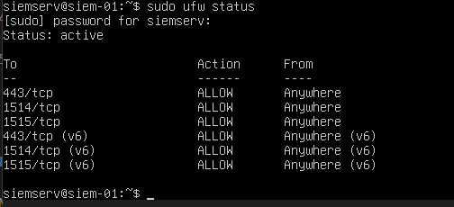

- I tried once again but was still unable to access the Wazuh Dashboard, I was still getting the same error
- Then I saw a blog on Medium where it said that we can create a secure connection to Wazuh through our local machine via port forwarding enabled on the VM [Medium Blog](https://medium.com/@ritikpatel976/wazuh-siem-deployment-and-endpoint-monitoring-25f10667b063)
- Also since the Ubuntu Server VM already had a 2nd network adapter set to NAT it was getting outbound internet access and also isolated the VM network
- Port Forwarding on the Ubuntu Server VM created a path for my local machine to access the Wazuh Dashboard through port 8443 which I set it to

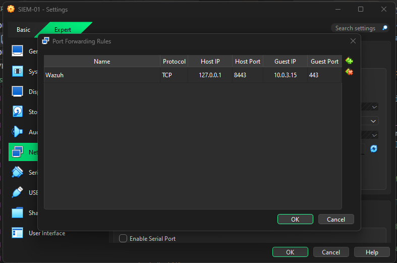

- After setting up port forwarding on the Ubuntu VM, I tried to access the Wazuh Dashboard on my local machine via *https://localhost:8443*
- Confirmed that I was able to access my newly configured Wazuh Dashboard

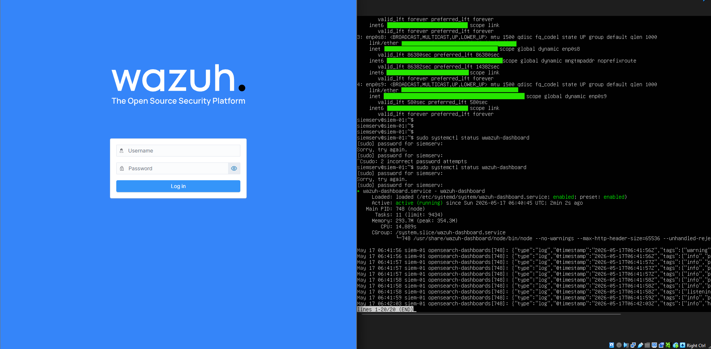

---

### ✅ Deploy a new agent to add to Wazuh Dashboard

Now that I am able to access the Wazuh Dashboard, I needed to add my WIN10-CLIENT machine to it to gather security logs

#### Steps Followed

- I accessed my Wazuh Dashboard on my localhost through Google Chrome
- Then I went into *Agent Management* to add a new agent to start gathering and monitoring the security logs of my Windows Client machine; WIN10-CLIENT
- I ensured that the Windows OS was selected and that the IP of the Windows Client VM was selected, and then gave it a unique name

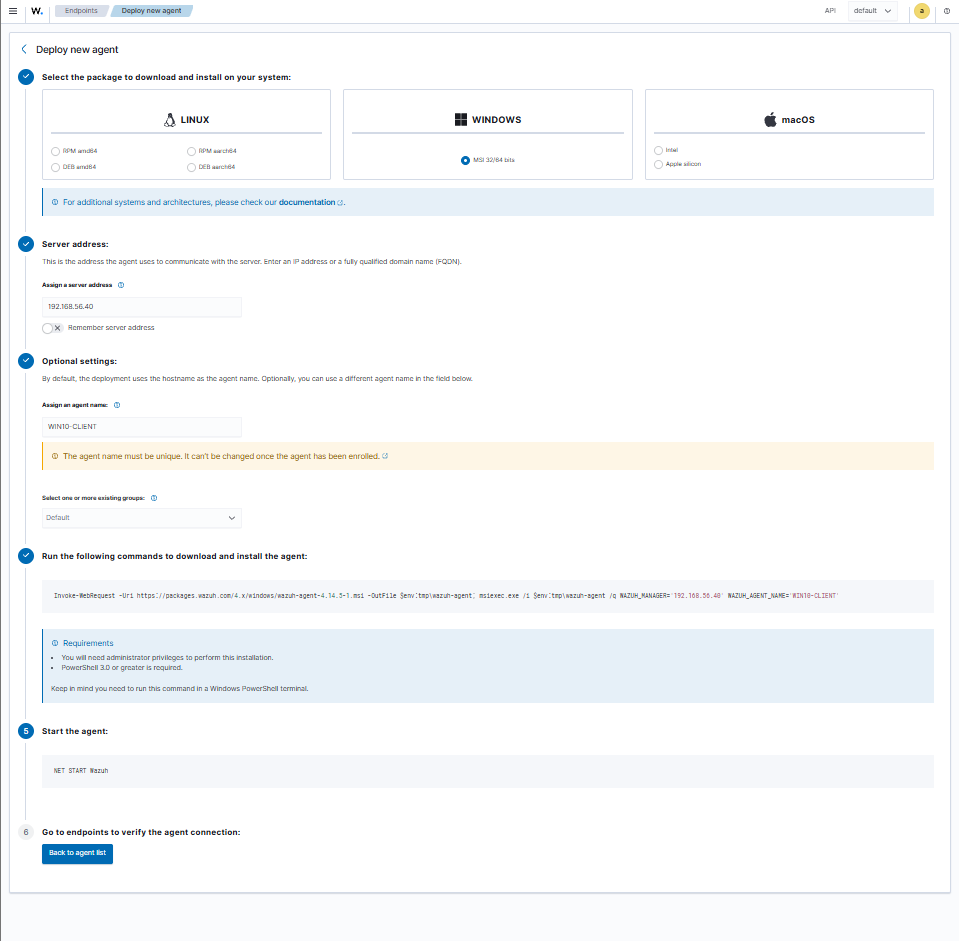

- I then launched my WIN10-CLIENT VM and went into powershell to execute the installation cmd that Wazuh provided on the agent setup panel
- I had to add a 2nd adapter and enable NAT on the VM just to install the agent, I then disabled this feature after
- First I was not sure whether which account to log into my WIN10-CLIENT vm to install the Wazuh Agent, but for ease I logged into the IT Admin account I created previously in Active Directory to install it
- First when I tried to execute the Wazuh cmd, nothing happened, and that is where I realized that I needed to run Powershell as administrator in order to run the cmd
- But stil posed an issue because, multiple times I had the *Windows Installer* pop-up and halting the installation of the agent

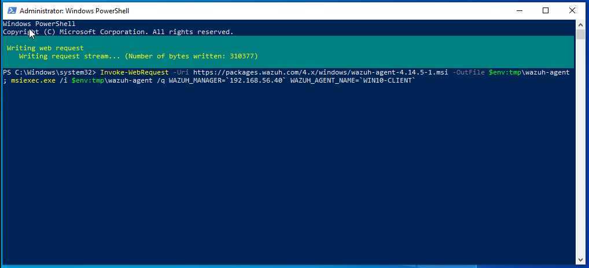
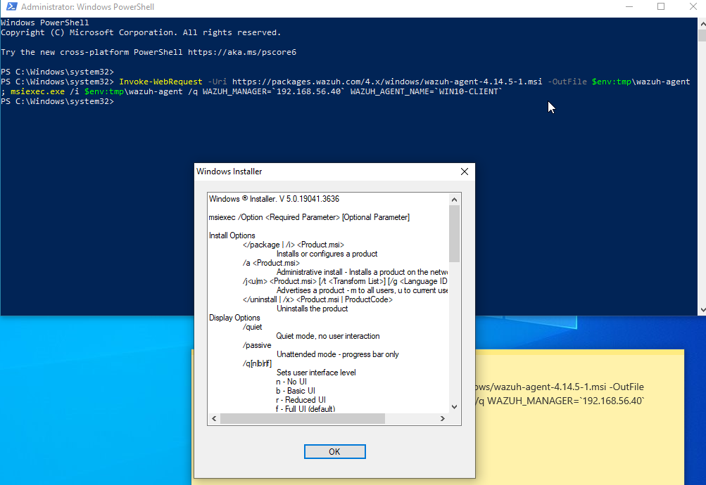

- All tutorials I looked up had it easy where they were able to install the Wazuh Agent by just copy pasting the cmd
- So I consulted with ChatGPT and it mentioned that it was most likely due to this part of the Wazuh Agent cmd:

```bash
$env:tmp\wazuh-agent        # Windows Installer does not like that there is actually no .msi file being created here
```

- So I added *.msi* to that part and ran the cmd again and still the same issue

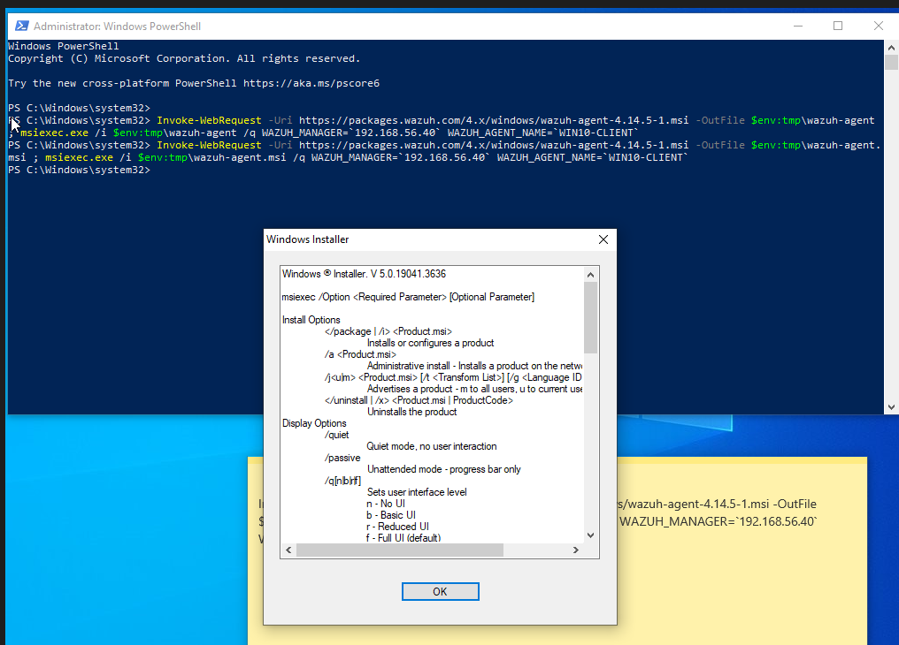

- So I went into the WWazuh documentation and saw that there is a Windows Installer option
- Since I had NAT enabled, I opened Microsoft Edge and went to the Wazuh documentation site [Wazuh Documentation](https://documentation.wazuh.com)
- And I installed the Windows installer for Wazuh
- I then followed the prompts it came with and was prompted with Wazuh Agent panel where it prompted to add the Wazuh Manager IP and Auth key
- I then went on to add my Ubuntu Server's IP where I had Wazuh installed and configrued on
- Then on my Ubuntu Server, I added my WIN10-CLIENT machine as an agent to it as well where it created an authentication key which I added to WIN10-CLIENT Wazuh Agent panel
  
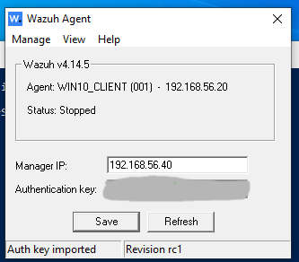

- I then went back to Powershell on my WIN10-CLIENT and started the agent

```bash
Net START WazuhSvc          # CMD to start Wazuh agent and initial scan
```

- I then went back to my Wazuh Dashboard and confirmed that it added my WIN10-CLIENT as an agent, ready for me to play with
  
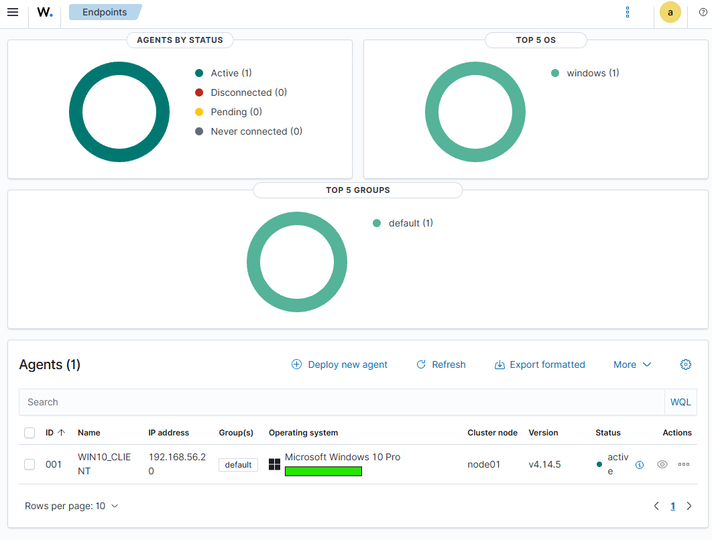

---

## ⚠️ Troubleshooting & Challenges

### Issues Encountered

- Wazuh dashboard failed to start initially
- Ubuntu storage volume not expanded after increasing VM disk size
- Host-only adapter routing conflicts
- Windows endpoint lacked internet connectivity initially
- MSI installer issues due to missing `.msi` extension

---

### Solutions Implemented

- Expanded Ubuntu LVM partition
- Verified Wazuh services with systemctl
- Configured NAT port forwarding instead of Host-only networking
- Added NAT adapter to Windows endpoint VM
- Utilized Wazuh Windows Installer

---

### 🧠 Key Takeaways

- SIEM platforms require significant system resources and proper networking configuration
- NAT Port Forwarding is a secure and practical method for local SIEM dashboard access
- Endpoint telemetry is essential for centralized monitoring and visibility
- Linux storage management and troubleshooting are important infrastructure skills

---

### 🚀 Next Steps

- Install Sysmon on Windows endpoint
- Integrate Sysmon logs into Wazuh
- Simulate brute-force attacks
- Generate and analyze security alerts
- Create custom detection rules
- Begin threat hunting exercises

---

## 📚 References

- [Wazuh Documentation](https://documentation.wazuh.com)
- [Wazuh Instalation Guide](https://documentation.wazuh.com/current/installation-guide/index.html)
- [Medium Blog](https://medium.com/@ritikpatel976/wazuh-siem-deployment-and-endpoint-monitoring-25f10667b063)
- [Connecting Windows Endpoint to Wazuh](https://infosecwriteups.com/connecting-a-windows-endpoint-to-wazuh-e4b21e941f3e)
