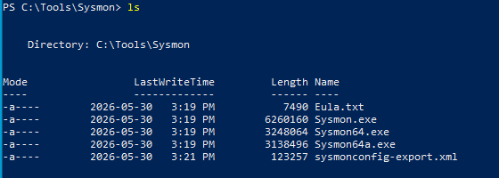
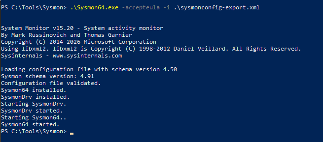
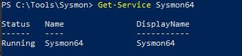
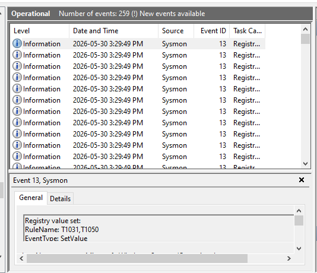
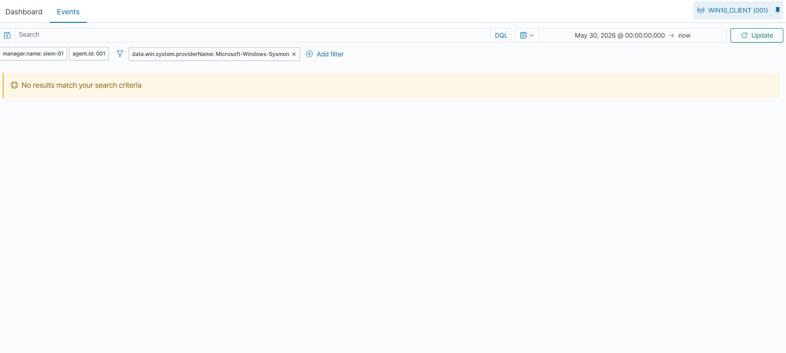
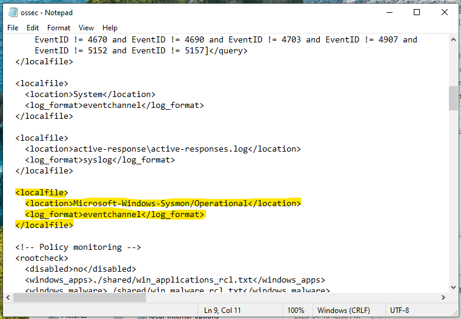
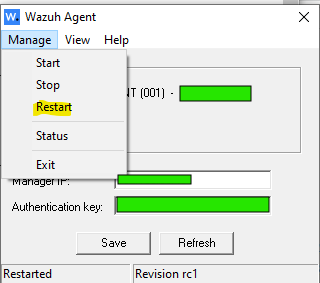
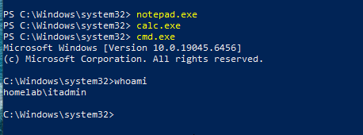
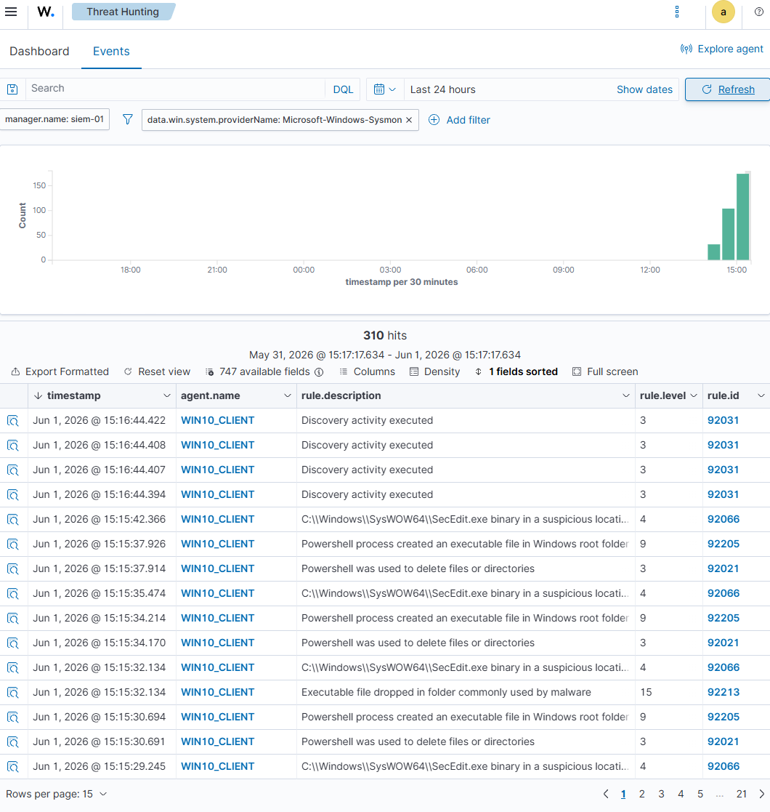

# Day 7 — Sysmon Deployment and Enhanced Windows Telemetry

## 🎯 Objective

Install and configure Sysmon on WIN10-CLIENT to improve endpoint visibility and generate richer security telemetry for Wazuh.

---

## 🧱 Lab Components

| Machine      | Role              | IP Address    |
|--------------|-------------------|---------------|
| WIN10-CLIENT | Windows endpoint  | 192.168.56.20 |
| SIEM01       | Wazuh SIEM server | 192.168.56.40 |

---

## 🛠️ Tools Used

- Sysmon
- Wazuh Agent
- Windows Event Viewer
- PowerShell

## 🧠 Key Concepts Learned

- Security Telemetry Pipeline
- Log Collection vs. Detection
- Event Channels
- Threat hunting Fundamentals
- Deteection Engineering Basics
- Endpoint Visibility and Telemetry Collection

---

## ⚙️ Task to Complete

### ✅ Installing Sysmon Config files

- Install Sysmon on windows client for enhanced endpoint visibility
- Install SwiftOnSecurity for Sysmon configurations

#### Steps Followed

- First I went to Microsoft Internals to download the zip file for Sysmon on the windows machine [Microsoft Internals](https://learn.microsoft.com/en-us/sysinternals/downloads/sysmon)
- I then extracted the contents of the zip Sysmon archived file
- Then I installed the SwiftOnSecuirty configurations for Sysmon, I used *Invoke-WebRequest* cmd to install the config file
  - This can be found in: [SwiftonSecurity Configuration](https://github.com/swiftonsecurity/sysmon-config)

```bash
Invoke-WebRequest -Uri "https://raw.githubusercontent.com/SwiftOnSecurity/sysmon-config/master/sysmonconfig-export.xml" -OutFile "sysmonconfig-export.xml"
```



- Once all files are in the specified location root file of the VM, I proceeded with installing Sysmon on the Windows client

```bash
.\Sysmon.exe -accepteula -i .\symonconfig-export.xml
```



- Then I made sure that Sysmon was running

```bash
Get-Service Sysmon64
```



### ✅ Generate Test Logs to Confirm Sysmon Functionality and Wazuh visibility

- Generate test logs to check if Sysmon logs are getting detected and that it is visible in Wazuh dashboard

#### Steps Followed

- Once Sysmon was fully installed and running on the Windows VM
- In Powershell, ran the following test commands to simmulate running and closing processes:

```bash
> whoami
> notpad.exe
> calc.exe
> cmd.exe
> powershell.exe
```

- Went to Event Viewer -> Application and Service Logs -> Microsoft -> Windows -> Sysmon -> Operational
- Confirmed that the processes that was ran through Powershell showed with event ids of 1 and 5



- Then ran Siem server to initiate Wazuh dashboard and accessed it throught the browser on local machine
- As it was my first time working with Wazuh, I was quite confused on how to search up for detected events for the windows client
- So I watched a video by John Jammond [Wazuh Tutorial](https://youtu.be/nSOqU1iX5oQ?si=yn_aGi9wGdC-sNuy) for a quick tutorial on how to search in Wazuh
- In John's tutorial, I learned all about detection engineering and how to look for threats and understand the events that shows in Wazuh from the agent
- While watching the video, I noticed that I missed a crucial step to ensure that Wazuh is actually getting the Sysmon events
- I had to edit the Wazuh Agent ossec.conf file to instruct Wazuh to collect logs from the Sysmon Operational event channel.
- I went and confirmed this by opening up Wazuh and going into my windows agent -> Threat Hunting -> Events and saw that the Sysmon events were not showing up



- Following the video I made these changes
- Opened ossec.conf in notepad as administrator
- Added the following lines to the file under the ossec configuration

```xml
<localfile>
    <location>Microsoft-Windows-Sysmon/Operational</location>
    <log_format>eventchannel</log_format>
</localfile>
```



- After edditing the file and saving it, I had to restart the Wazuh Agent on the my Windows VM
- So I went to the Wazuh Agent and restarted it and created new test logs in powershell
- I gave my Wazuh dashboard a few minutes to before refressing it and was able to confirm that Wazuh was detecting the Sysmon events and outputting them
- I was then able to create a rule in Wazuh to dettect Sysmon specific events





## ⚠️ Troubleshooting & Challenges

### Issues Encountered

For today's lab, it was generally easy to integrate Sysmon and its configs into my Windows client machine. The only thing that was a struggle was trying to get Wazuh to see the Sysmon logs.

Luckily I was able to find John Hammond's video on detection engineering and from there. He taught me how to properly integrate Sysmon with Wazuh, it was just that one key step I forgot to do, which was updating the ossec.conf file to have Wazuh recognize the Sysmon events.

And from watching his videos I was able to learn how to search properly in wazuh for events and where to look and an event looks suspicious. Without it I would have been lost trying to understand how to search anything up or how to even maneuver in Wazuh.

---

### 🧠 Key Takeaways

- Wazuh provides the SIEM platform and detection engine, while Sysmon enriches endpoint telemetry by generating detailed process, network, and file activity logs that are not available through standard Windows logging alone.
- Wazuh needs to be explicitly told to check for Sysmon event logs by updating the ossec.conf file
- Rules is the biggest factor when it comes to enhance workflow and to enable the security analyst to work efficiently looking for threats withing the system using EDR/XDR tools such as Wazuh

---

### 🚀 Next Steps

- Investigate generated alerts
- Analyze Rule IDs and alert severity levels
- Generate Windows authentication events
- Simulate failed login attempts
- Perform basic incident investigation workflows
- Begin developing SOC analyst investigation procedure

---

## 📚 References

- [Microsoft Internals](https://learn.microsoft.com/en-us/sysinternals/downloads/sysmon)
- [SwiftonSecurity Configuration](https://github.com/swiftonsecurity/sysmon-config)
- [Wazuh Tutorial](https://youtu.be/nSOqU1iX5oQ?si=yn_aGi9wGdC-sNuy)
