# Day 8 — Authentication Monitoring & Account Lockout Investigation

## 🎯 Objective

Investigate Windows authentication events and Active Directory account lockouts using Wazuh SIEM.

---

## 🧱 Lab Components

| Machine      | Role              |
| ------------ | ----------------- |
| DC01         | Domain Controller |
| WIN10-CLIENT | Windows Endpoint  |
| SIEM01       | Wazuh SIEM Server |

---

## 🛠️ Tools Used

- Wazuh
- Active Directory
- Windows Event Viewer
- PowerShell
- Group Policy

---

## 🧠 Key Concepts Learned

- Authentication Monitoring
- Windows Event IDs
- Account Lockout Policies
- Event Correlation
- Active Directory Security Logging
- Incident Investigation
- SIEM Threat Hunting

---

## ⚙️ Tasks Completed

### ✅ Deploy Wazuh Agent to Domain Controller

- Add Domain Controller as a new Wazuh Agent to capture account lockout logs on Wazuh Dashboard

#### Steps Followed

- Deployed a new windows agent on Wazuh Dashboard
- Installed Wazuh Agent Installation wizard on Domain Controller vm (DC01)
- Temporarily enabled NAT to install the installation wizzard
- Started the Wazuh Agent service and verified successful registration with the Wazuh Manager.

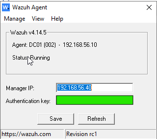

- Verified that DC01 appeared as an active agent in Wazuh
  
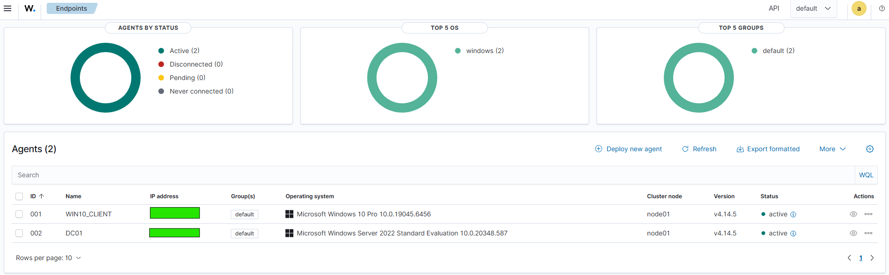

---

### ✅ Generate Failed Authentication Events

- Generate failed authentication events to exercise threat log detection and Windows client and Domain server log visibility

#### Steps Followed

- First selected Jane Smith user account to test out failed login attempts and account locked out logs
- User account for Jane Smith is: *HOMELAB\jsmith*
- I was able to successfully lockout the account by inputting invalid passwords

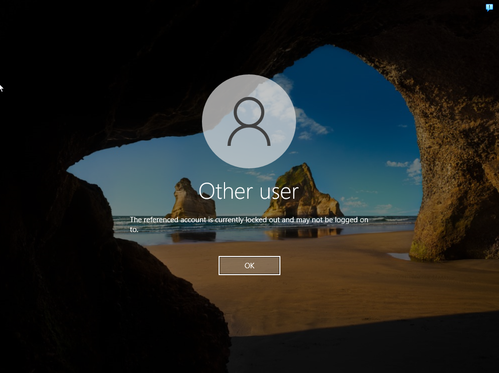
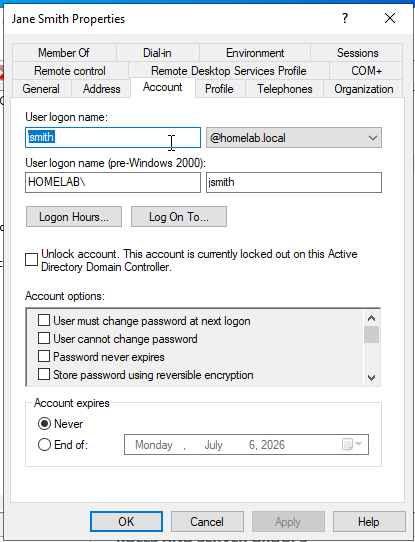

- With the account locked out I went into Wazuh Dashboard and saw that the failed login attempt logs appeared in Wazuh dashboard
- I filtered the event logs to only output failed login attempts, successfull logins, and account locked events
- I noticed that failed and successful authentication events were visible in Wazuh, however account lockout events were not present.

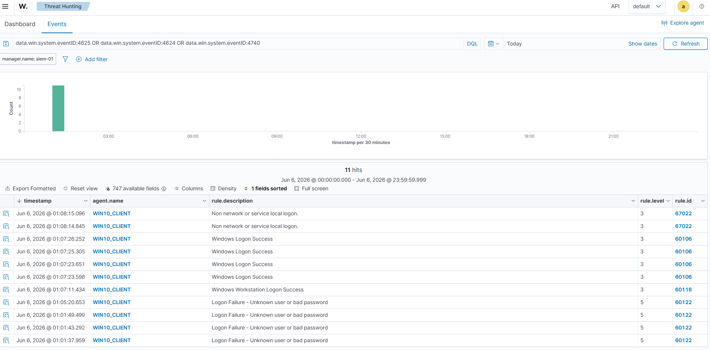

- From there I noticed that the account lockout events were not being ingested by Wazuh
- So decided to add my Domain Controller as a new active agent in Wazuh (Steps completed in the above section)
- Then I went and tried to generate failed login attempts with user account Carson James (*HOMELAB\cjames*)
- Successfully locked out the account
- Then after unlocked and reset account password to default in Domain Controller Active Directory and was able to login and succeffully reset password to a secure one

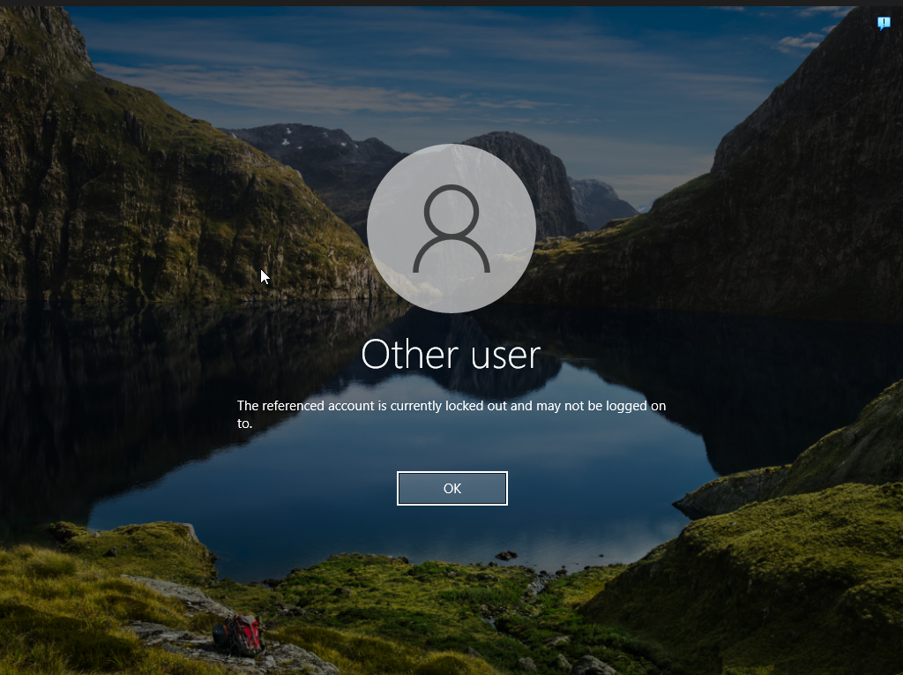
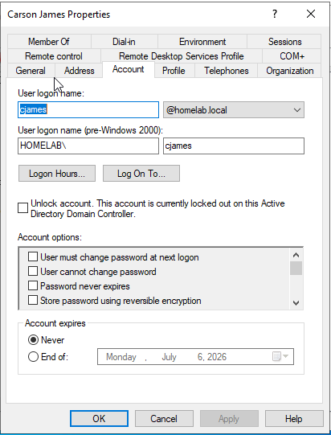
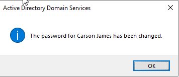
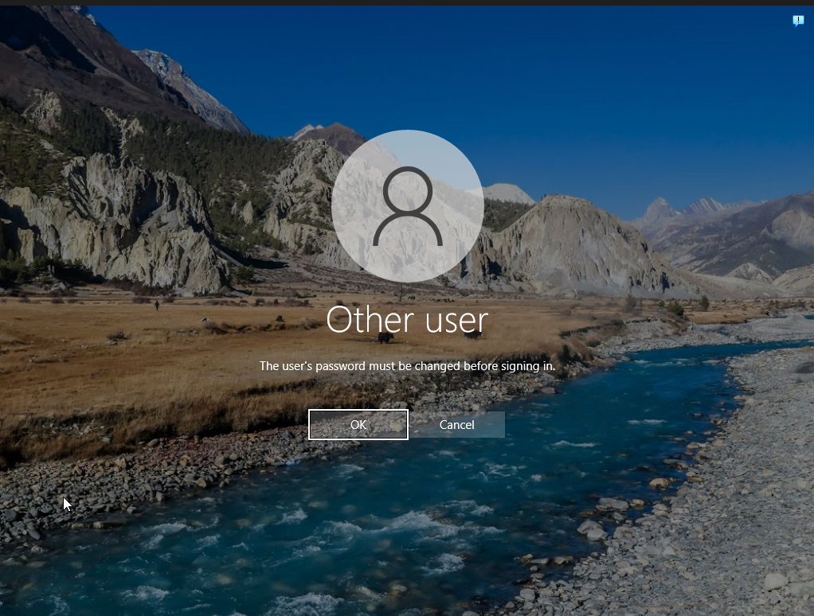
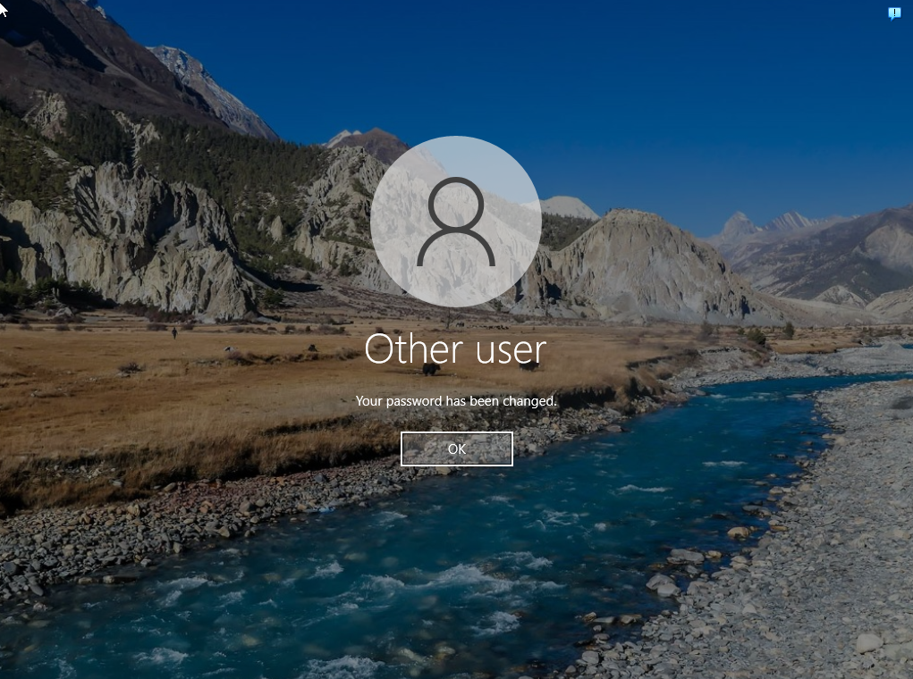

- Then I went to check Wazuh Dashboard to check the event logs and confirmed that all the failed logins, successfull logins, and account lockout was visible

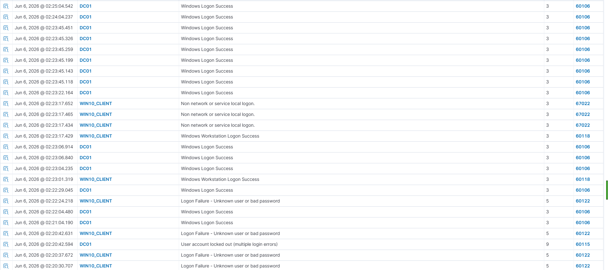
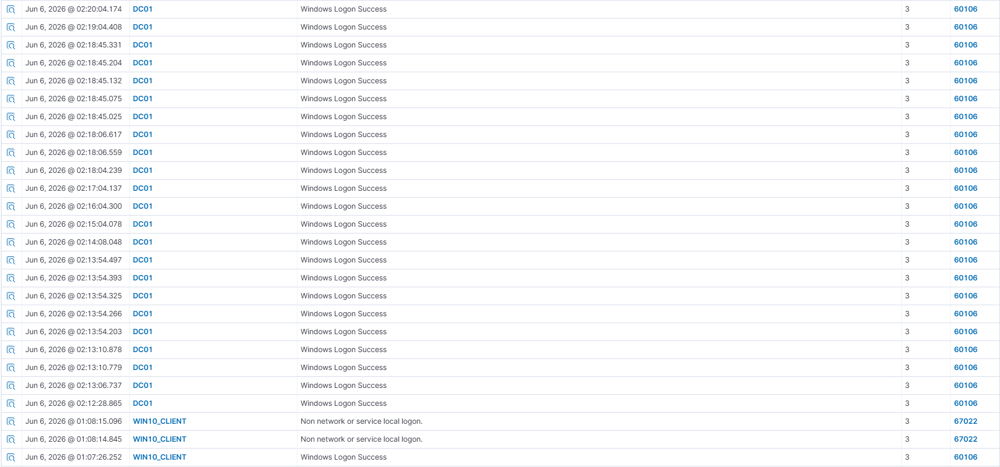
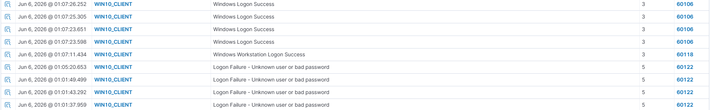

---

### ✅ Investigate Authentication Events

- Investigate the failed login attempts and account lockout logs in Wazuh
- Create an Incident report of the investigatin

#### Steps Followed

- Created [IR-001-Account-Lockout.md](../incident-reports/IR-001-Account-Lockout.md) for a detail report of the investigation

##### Authentication Events Observed

| Event ID | Description      |
|----------|------------------|
| 4624     | Successful Logon |
| 4625     | Failed Logon     |
| 4740     | Account Lockout  |

---

## ⚠️ Challenges Encountered

### Initial Visibility Issue

Initially, account lockout events were not visible in Wazuh.

#### Root Cause

The Domain Controller was not configured as a Wazuh agent.

#### Resolution

- Installed Wazuh Agent on DC01.
- Verified Active Directory events were being ingested into Wazuh.

---

## 🧠 Key Takeaways

- Security events are often generated on different systems than where the activity originated.
- Failed authentication attempts can originate from an endpoint while account lockouts are enforced by Active Directory.
- Event ID 4625 identifies failed authentication attempts.
- Event ID 4740 identifies account lockouts.
- Security investigations often require collecting logs from multiple systems.
- Wazuh can correlate endpoint and Active Directory events into a single investigation workflow.

---

## 🚀 Next Steps

- Investigate password reset events (Event ID 4724)
- Monitor successful logons (Event ID 4624)
- Create custom Wazuh detection rules
- Simulate brute-force authentication attacks
- Create additional incident reports
